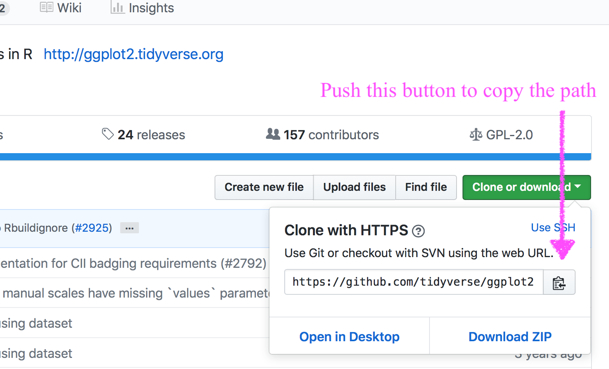
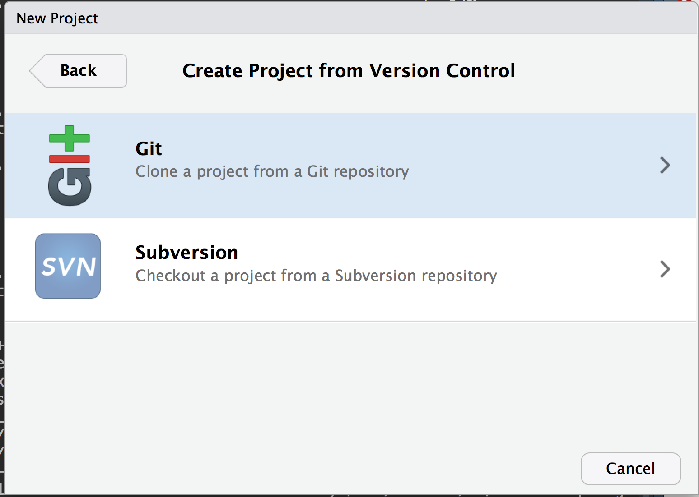
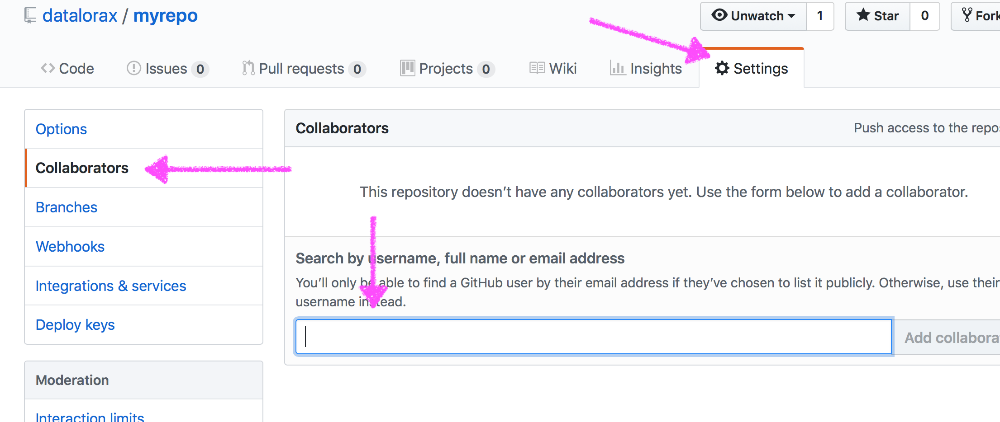

```{r include = FALSE, results = "asis"}
source("slide-setup.R")
knitr::opts_chunk$set(
  message = FALSE,
  warning = FALSE,
  echo = FALSE,
  fig.width = 9
)
```

`r setup("index")`

---
# Hi!

I'm Daniel

* Data Scientist at [Abl](https://www.ablschools.com/)

* Former Research Associate Professor here!

* Helped create the program you're in!

* Dad of two girls (9 and 11), and husband to Julia

---
class: inverse-blue middle
background-image: url(img/fams.jpeg)
background-size: cover


---
# Today

Let's talk git/GitHub

* What is it?

* Why would you use it?

* How do you use it?

---
# Learning objectives

* Understand the basics of git and git vocabulary

* Be able to create repos, push projects, commit changes

* Begin collaborating on a project

* Understand and be able to use branches


---
class: inverse-red middle

# What is it?

---
class: inverse-blue middle
background-image:url(img/final-doc.png)
background-size:contain

.footnote[“Piled Higher and Deeper” by Jorge Cham, http://www.phdcomics.com]


---
background-image:url(http://swcarpentry.github.io/git-novice/fig/play-changes.svg)
background-size:contain

.footnote[From swcarpentry]

We can think of the changes as separate from the document

---
background-image:url(http://swcarpentry.github.io/git-novice/fig/versions.svg)
background-size:contain

.footnote[From swcarpentry]

Many possible versions of same doc


---
background-image:url(http://swcarpentry.github.io/git-novice/fig/merge.svg)
background-size:contain

.footnote[From swcarpentry]

.pull-right[Multiple changes!]

<!-- Unless there are conflicts, two changes from the same document can be merged
together -->

---
# How?
That's what we'll talk about today!

--

Goals:
* Get you to understand the structure of git

* Actual method of completing the tasks is up to you

  + GUI? Command line? RStudio?

--

* If you go with a GUI, I'd recommend [GitKraken](https://www.gitkraken.com) (freemium app) or the [GitHub Desktop](https://desktop.github.com/) (free and open source)


---
# Some basic terminology

* Version Control System

  + A tool to help us track changes. *git* is one such system (but there
    are others).

--
* Commit

  + Changes that have been made to the file(s)

--
* Repository (repo)

  + The files, full commit history, and associated metadata for a project


---
# When working with git
* Each collaborator has the *entire* repo on their local machine

* There is also (usually) a cloud-based server hosting the repo (for us, that's GitHub)

* The online version of the repo is call the *remote*

---
# Some key points

* Because *git* tracks the **entire** history of a project it is akin to
  unlimited "undo"

  + I'll show you how I do this later

* *git* allows many people to work in parallel (just do so in a principled way)


---
# Setup

I'm assuming you're all setup. If not, please do the following

* [Download and install](https://git-scm.com/downloads) *git*

* [Register](https://github.com) for a GitHub account

* [Download and install](https://www.gitkraken.com/download) GitKraken or [GitHub Desktop](https://desktop.github.com/) (or try both)

---
# *git* vs GitHub

*git* and GitHub are somewhat analogous to R and RStudio

* R is the "engine", RStudio is the IDE

* *git* is the "engine", GitHub is the web-based hosting service


--
It's somewhat easy to conflate these things, but it's important to keep them separate... Why?


---
# Why use a GUI

You could argue it would be better to focus on the command line interface.

--
## My experience

--
Most people have an easier time grasping the *concepts* of *git* (like branching) when there's a visual interface


--
GitHub Desktop/GitKraken allow you to do 95%+ of the work you need to do without moving to the CLI

---
# Why use a GUI

If you decide to go with CLI eventually, that's totally fine. You'll probably need to for some operations. But as Jenny Bryan notes

> No one is giving out Git Nerd merit badges


--

So use the tools that make you most effective

--

I personally use the plugins for VSCode (the editor I now use instead of RStudio)


---
class: inverse-orange middle

# Big picture

### Why do we use *git*?

---
# We use *git* to:

* Contain version control and track changes to documents over time


--
* Increase transparency and reproducibilty in process


--
* Collaborate with others efficiently and effectively

--
* Share our work with others

---
class: inverse-red middle

# Warning
This will be painful at times. I believe the payoff is worth the effort.

The vocabulary is a significant part of the battle

---
class: inverse-blue center bottom
background-image:url(https://cdn-images-1.medium.com/max/1600/1*aFHTAkhTkyWD93-UGRttPw.png)

## Creating repositories: Starting with an empty project

---
# GitHub first

If you are starting a new project and you're going to use version control, I suggest going GitHub first

--
* Create a new repo on Github

* Clone the repo locally

* Start your project (i.e., [RStudio Projects](https://rstudio.com/resources/webinars/managing-part-1-projects-in-rstudio/))

* Commit your initial changes

* Push the changes to the remote

---
# GitHub first

The GitHub first method is probably easier and what I would generally recommend.

However, sometimes you already have a project started, and you want to turn it into a repo


---
class: inverse-green middle center

# [demo]

Let's look at the git plugin in RStudio, and I'll quickly show you the same things in GitKraken and GitHub Desktop


---
class: inverse-red middle center

# Review of what we just did
### With Rstudio

---
# GitHub
Go to GitHub
* Select drop down by your profile, then "New Repository"

* I'd suggest also adding the R .gitignore and a README

<div >

</div>


---
# Name it

<div >

</div>


---
# Copy path



---
### Create a new RStudio Project


---



---


---


---
class: inverse-blue center bottom
background-image:url(https://cdn-images-1.medium.com/max/1600/1*aFHTAkhTkyWD93-UGRttPw.png)

## Creating repositories: Starting with an existing project

---
# Project first

If you already have an existing project, you need to:

* Initialize the repo locally

* Create an empty repo on GitHub

* Connect your local repo to the remote

---
class: inverse-green middle center

# [demo]


---
# Tracking

Notice the hidden `.git` folder


--
On mac, show hidden files with

```
cmd + shift + .
```

(Note, I have hidden files shown all the time)

--

* As long as that folder exists, the **entire** folder will be
tracked.

  + **Do not create repos inside of repos**

  + If you want a folder to show up in git, there needs to be something in it (e.g.,
    a `README.md`)


---
# Ignoring Files
* When we initialized the repo, we started it with a `.gitignore` file

* The `.gitignore` file tells the repo not to track certain files

  + e.g., proprietary data


--
Probably not super important for now, but if you need to ignore a file in your repo for whatever reason, just put the name of the file in the `.gitignore`


---
# Adding a file
* Let's create an R Markdown file and put it in our repo.

* Open terminal, type `git status`. What do you see?

* Use the RStudio `git` plugin. What do you see? What about with other *git* GUIs?

[demo]

---
# Staging
* When you add files to a repo you are *staging* them for tracking.

[demo]


--
Command line version is `git add <file>`

---
# Commits
After staging, you *commit* changes to the file


---
# Push
After you've committed the changes you want, push them to the remote

--


Wait what's a remote again?


--
The cloud-based repo

---
# Refresh the repo


---
# An overall view


---
# Revisiting some vocabulary
* stage
* commit
* push
* pull
* clone


--
At least half the difficulty with *git* is all the weird words

---
### Simple git through command line

90% of your workflow requires just a few commands.

* `git clone <path>`
  + Used once - gets the remote repo on your local.

--
* `git pull`
  + Syncs your local repo with the remote

--
* `git add`
  + Stages files in your local repo to be tracked

--
* `git commit <file> -m "my commit message"`
  + Commits changes to files in the repo

--
* `git push`
  + Pushes changes from your local repo to the remote

--
* `git status`
  + Gives you an update on your local repo (what files still need to be added,
    what changes have been made since last commit, etc.)

---
# Collaborating
Need to get proper permissions. Two methods:
* Add users to a repo: Settings => Collaborators => add user w/ username




---
# Collaborating
Second method:
* Create an organization

<div >

</div>

---
# Cloning
Means you're downloading the repo

--
* Can also start a new RStudio project

--

```{bash, eval = FALSE}
git clone <path>
```

<div >

</div>


---
# Merge conflicts

* Remember to always `git pull` first

* Merge conflicts only occur if you try to edit *the same line* of an out-of-date file

* Let's create and resolve one with the README file.

* Let's create a merge conflict!

(Note the GUI from *gitkraken* is really nice for resolving them)

---
# Merge conflict activity
1. Get a partner

1. Partner1 add Partner2 as a collaborator

1. Partner2 clone the repo

1. Partner1 make changes to the file in the repo, commit, and push

1. Partner2 make different changes **to the same parts** of the file. Commit the changes. Try to push. What happens? Why?

1. Open up the files - do you see some weird stuff that's been added?

### Wait for next steps

---
class: inverse middle center

## Merge conflicts w/gitkraken

<iframe width="560" height="315" src="https://www.youtube.com/embed/R1iWJNyRpQE" frameborder="0" allow="autoplay; encrypted-media" allowfullscreen></iframe>

---
# Some takeaways
Basic workflow is
* Create a repo

* Add collaborators

* Add files

* Commit changes

* Push changes to remote

---
# Advice on avoiding merge conflicts
* Always `git pull` (or the GUI equivalent) before you start working

* Try to stay in communication and don't work on the **exact** same thing at the same time

* Use a GUI to help you manage what merge conflicts you do run into

* Use branches

---
# Branching

Super powerful approach to collaborating with *git*. Essentially create a copy of the repo at a given point.

* Create and *checkout* a new branch.

* Make changes and commits *on the branch*, which frees you up to play and experiment without fear of "breaking" the main branch

* Push the branch to the remote

* When you're ready, submit a *pull request* to merge the branch with the main branch

* Note - any changes on the branch *will not be visible* if you don't have that branch checked out

---
class: inverse-green middle center

# [demo]


---
# Pull requests
Submit a PR for a branch when you're ready

Consider tagging others to review the changes before they are merged in

Link the PR to any relevant [Issues](https://guides.github.com/features/issues/).

Consider adding labels (e.g., bug fix, enhancement)

---
class: inverse-green middle center

# [demo]

---
# Forking

Similar process to branching, with a few major differences:

* You don't have to be (and shouldn't be) a direct collaborator

* You copy the entire repo *to your account*

  + You can then make whatever changes you want and push the changes to your fork

* If you want your changes implemented, you *must* submit a pull request (you can't contribute to the repo directly unless you're a collaborator) and *compare across forks*


---
# General advice

* Create a repo

* Add collaborators

* Always pull before starting new work

* Always commit all changes before finishing your work
  + If you don't do this, you might end up with automatic stashing

* File Issues to track work that should be completed
	- Include assignments for individuals
	- Tag issues to help with organization

---
# General advice
* Use branches to create new changes
  + A good rule of thumb - one branch for each issue

* Submit pull requests when the work on a given branch is complete, and link it to the corresponding issue
	- Tag collaborators to review the pull request
	- Use GitHub's review resources to comment on individual lines of code, as needed
	- Use the PR to have conversations about the changes and any revisions needed

---
# General advice

* Merge pull requests and delete the remote branch
	- Move back to your local, checkout the main branch, pull the merged changes, delete the local branch

---
class: inverse-green middle center

# Thanks!
### Questions?

--
If we have time - let's practice creating PRs